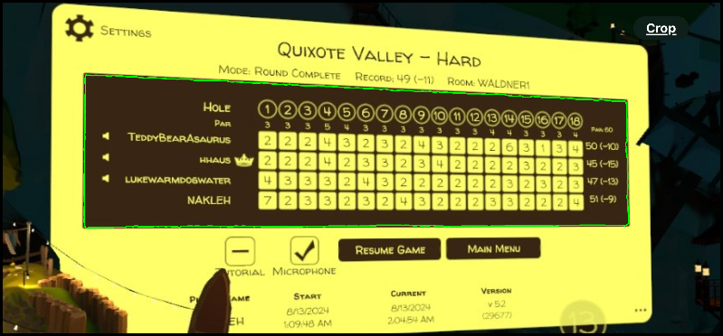
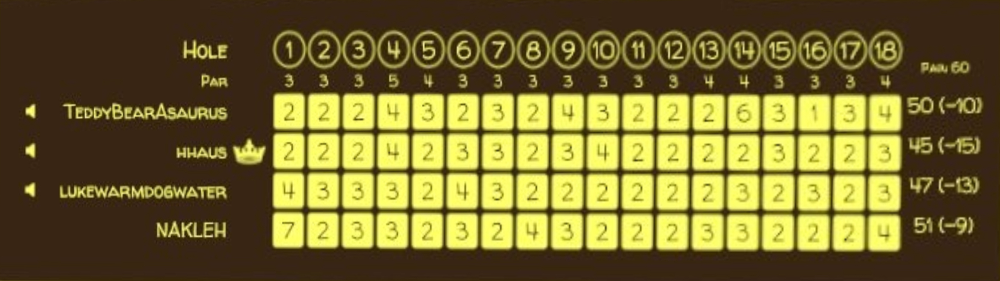
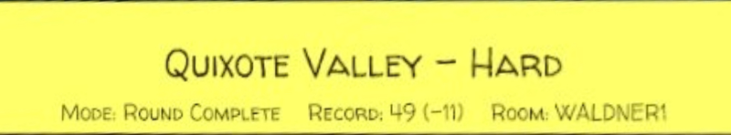
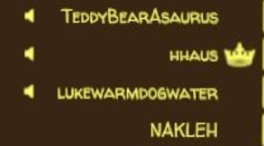
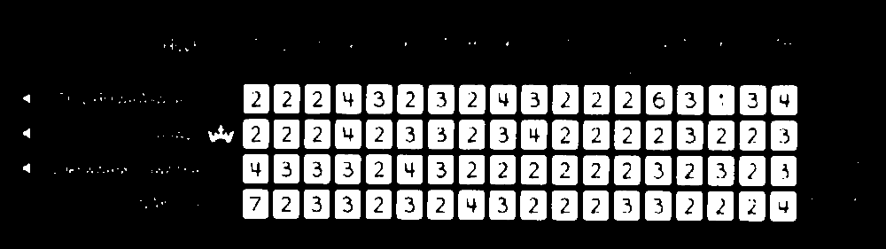
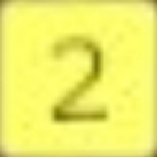
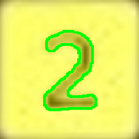
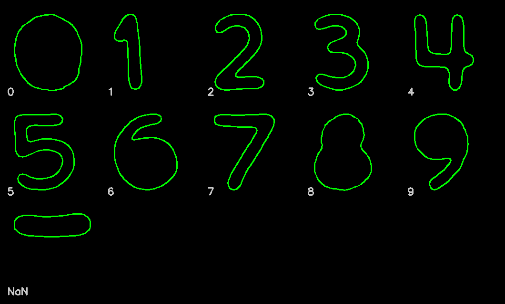
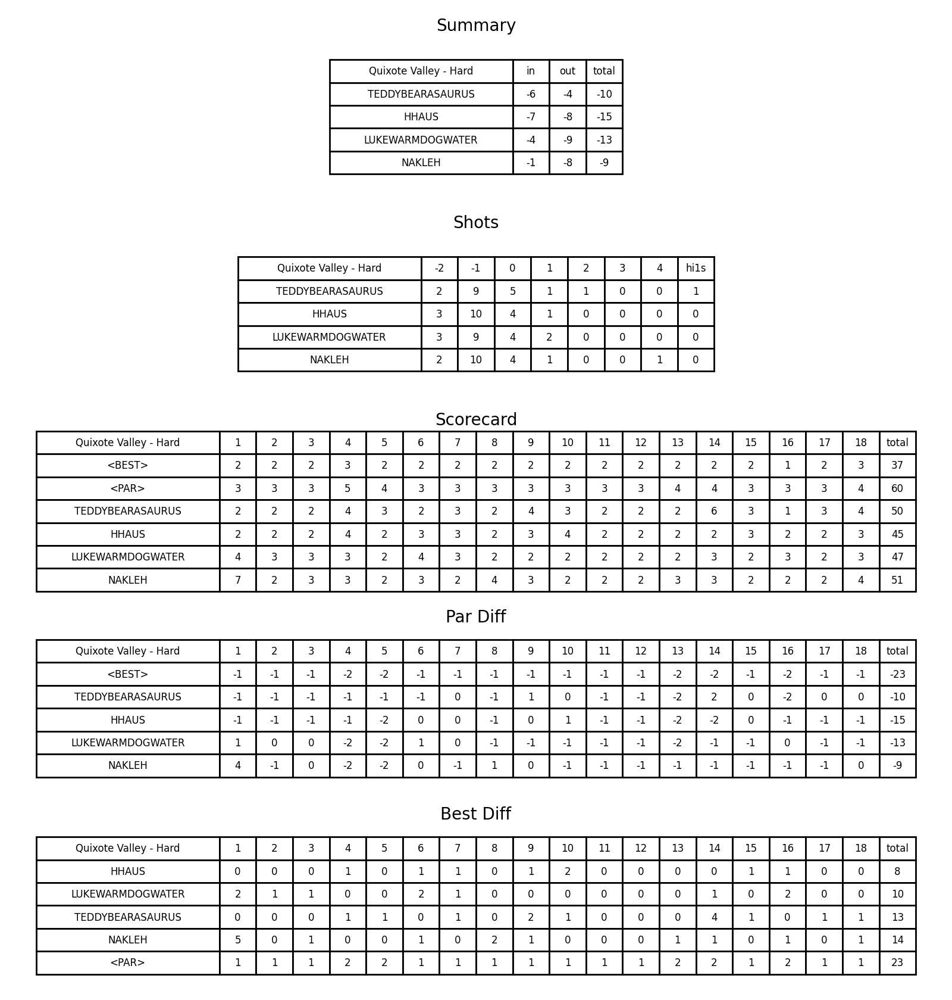

# Walkabout Minigolf Scorecard Reader

Extracts scores from screenshots of [Walkabout Minigolf](https://www.mightycoconut.com/minigolf) scorecards using computer vision and OCR.

Given one or more scorecard photos, it identifies the course, players, and per-hole scores, then produces summary tables.

This tool is relatively efficient, although I have not optimized anything. I have the bot running on a tiny server with 1GB RAM (although I have a pagefile for swap space) and it does fine. On my tiny server it might take 20-30 seconds to fully analyze a scorecard and produce the output files. On a capable machine it might take a second or two. Either way, much better than manual accounting :).

Note: for this repo to function properly `pars.csv` must be up-to-date and include the course you are trying to analyze.

## Table of Contents

- [How It Works](#how-it-works)
- [Files](#files)
- [Setup](#setup)
- [Usage](#usage)
- [Testing](#testing)
- [Example](#example)

## How It Works

1. **Scorecard detection** – Finds the brown scorecard region by color filtering and contour detection.
2. **Perspective correction** – Warps the detected region so angled photos are straightened.
3. **Score extraction** – Locates the yellow score rectangles, isolates digit contours, and matches them against pre-trained standard contours using [procrustes analysis](https://docs.scipy.org/doc/scipy/reference/generated/scipy.spatial.procrustes.html).
4. **Course identification** – Crops the area above the scorecard, runs OCR (PaddleOCR), and fuzzy-matches against known course names from `data/pars.csv`.
5. **Player identification** – Reads player names from the left column via OCR.

I tried using OCR for everything, including the score extraction. However, surprisingly, OCR tools could not reliably classify the digits out of the box. It was often correct, but usually wrong at least once per scorecard, which effectively made it useless.

The digits are always the same font and have no variance (other than perspective and image quality), so I decided to switch to a contour comparison method (procrustes), which seemed easy and straightforward. 

## Files

| File | Purpose |
|---|---|
| `main.py` | CLI entry point – process one or more scorecard images |
| `bot.py` | Discord bot – responds to `!larrybot review` with scorecard summaries |
| `scorecard.py` | `Scorecard` class and OCR-based extraction functions |
| `image_manipulation.py` | Image processing: warping, contour detection, color filtering |
| `utils.py` | Utilities: standard contour loading, image export, string distance |
| `constants.py` | Color constants and detection thresholds |
| `prep.py` | Tools for generating `data/standard_contours.pkl` training data |
| `validate.py` | Regression tests against ground-truth `.sol` files |

### Data directory (`data/`)

| Path | Purpose |
|---|---|
| `data/pars.csv` | Par values for all known courses |
| `data/standard_contours.pkl` | Pre-trained digit contour templates |
| `data/contours/` | Saved digit contour images organized by course and digit, used for training |
| `data/scorecards/` | Test scorecard images with corresponding `.sol` ground-truth files |

## Setup

```bash
python3 -m venv myenv
source myenv/bin/activate
pip install -r requirements.txt
```

## Usage

### CLI

```bash
python main.py <image_path> [<image_path> ...]
```

For example,
```bash
python main.py data/scorecards/8bitlair-easy-0.jpg
```

Pass multiple images from different halves of the same round and they will be combined into a single scorecard.

### Discord Bot

Requires a `DISCORD_TOKEN` environment variable (or `.env` file):

```bash
python bot.py
```

In Discord, attach scorecard screenshot(s) and run:

```
!larrybot review
```

## Testing

```bash
python validate.py
```

Compares scorecard extraction against `.sol` files in `data/scorecards/`.

## Example

The following example uses a Quixote Valley scorecard.

### 1. Scorecard detection

The brown scorecard region is found by color filtering and contour detection:



### 2. Perspective correction

The detected region is warped to be straightened in 2D:



### 3. Course name extraction

The strip above the scorecard is cropped and sent to OCR. String edit distance is then run against all known course names to find the best match (since OCR is imperfect).



### 4. Player name extraction

The region to the left of the score grid is cropped and sent to OCR:



### 5. Yellow rectangle masking

A color mask isolates the individual score cells:



### 6. Digit recognition

Each score cell is extracted and the score contour is matched against all trained templates to find the best match using procrustes analysis:

<p>

&nbsp;&nbsp;→&nbsp;&nbsp;

</p>



### 7. Final output

The extracted data is assembled into summary tables:


